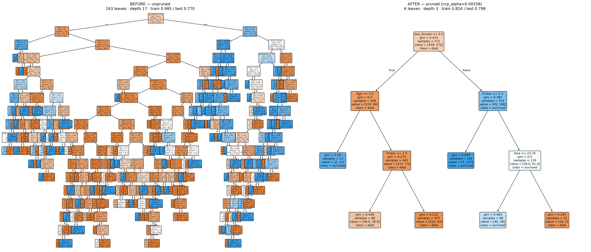
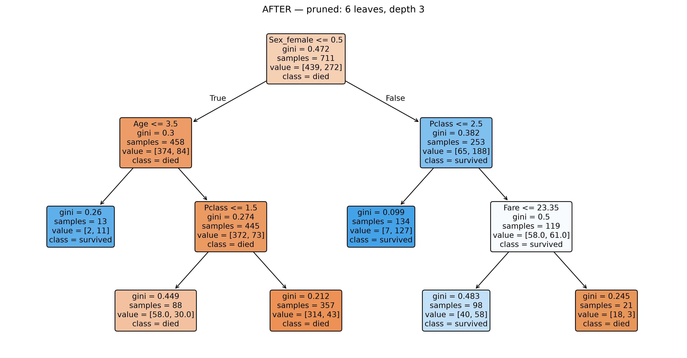

# Titanic Survival — Decision Tree

A binary classifier predicting who survived the Titanic, built as a full modeling pipeline: from messy-data cleaning to a tuned, cross-validated, cost-complexity-pruned tree you can read as a flowchart.

📓 Full build: [titanic.ipynb](titanic.ipynb)

## Key findings

- **Pruning beat complexity.** An unconstrained tree memorized the training data — 98.5% train accuracy, but only 77.0% on unseen passengers, a 21-point overfit gap. Cost-complexity pruning collapsed it from **163 leaves to 6**, and test accuracy *rose* to **79.8%**. The simpler model generalized better.
- **The tree rediscovered "women and children first."** Given no hints, its very first split is sex. Among men, only toddlers (Age ≤ 3.5) are predicted to survive; among women in 1st/2nd class, ~95% survive.
- **Sex did two-thirds of the work.** Feature importance: Sex (0.67) ≫ passenger class (0.20) > age (0.08) > fare (0.05). Six of ten features — including port of embarkation and family counts — were never split on.
- **A counterintuitive third-class signal.** Among 3rd-class women, a *higher* fare tracked with *lower* survival (only 3 of 21 survived above a fare of 23.35) — a small-sample pattern the model surfaces as a question worth asking, not a proven law.

## Before vs. after pruning

The same algorithm on the same data — unconstrained (left) vs. cost-complexity pruned (right). The left tree memorized; the right one learned.



## How it's built

1. **Clean** — drop `Cabin` (77% missing), drop the 2 rows missing `Embarked`, drop identifier columns (`PassengerId`, `Name`, `Ticket`).
2. **Split** — 80/20 train/test, stratified on survival to preserve the class balance.
3. **Impute** — fill missing `Age` with the **training-set** median (28.0), computed *after* the split so no test information leaks into preprocessing.
4. **Encode** — one-hot encode `Sex` and `Embarked`.
5. **Tune & prune** — cross-validate `max_depth` and cost-complexity `ccp_alpha` on the training set only; select the final tree with the **1-standard-error rule** (the simplest tree within one standard error of the best CV score).
6. **Evaluate** — spend the held-out test set exactly once.

## Results

| Model | Leaves | Depth | Train acc | Test acc |
|---|---|---|---|---|
| Unpruned tree | 163 | 17 | 0.985 | 0.770 |
| **Pruned (final)** | **6** | **3** | **0.824** | **0.798** |
| Majority-class baseline | — | — | — | 0.618 |

Final model on the test set (178 passengers):

| Class | Precision | Recall | F1 | Support |
|---|---|---|---|---|
| Died | 0.808 | 0.882 | 0.843 | 110 |
| Survived | 0.776 | 0.662 | 0.714 | 68 |

The confusion matrix breaks down to 97 deaths and 45 survivals correctly called, against 13 false survivors and 23 missed survivors. The model leans toward predicting "died" — catching 88% of actual deaths but only 66% of actual survivors — a bias that precision and recall make visible where a single accuracy number would hide it.

## What the model learned



Read it top-down: sex splits first, then class and (for men) age, then fare for 3rd-class women. The entire model is six rules — small enough to sanity-check against history. That's what makes an interpretable model useful: it hands you questions worth investigating, not just a score.

## The data

The classic 891-passenger Titanic training set (12 columns: passenger class, name, sex, age, family counts, ticket, fare, cabin, port of embarkation). The notebook loads it directly from a public mirror, so there's no data file to download.

Missing-data handling: `Age` (~20% missing) is imputed, `Cabin` (~77% missing) is dropped as a column, and the 2 rows missing `Embarked` are dropped.

## Run it yourself

```
git clone https://github.com/Alir3zag/titanic-decision-tree.git
cd titanic-decision-tree
python -m venv .venv
.venv\Scripts\activate         # Windows
# source .venv/bin/activate    # macOS / Linux
pip install -r requirements.txt
```

Then open `titanic.ipynb`, select the `.venv` kernel, and **Run All**.

## Built with

Python · pandas · scikit-learn · matplotlib